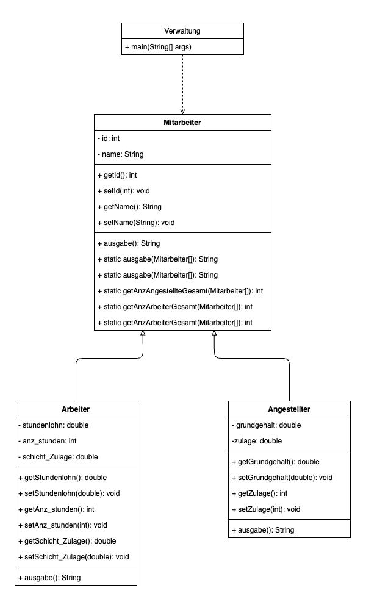

# Firma Version 1
Dieses Repo enthält die Java-Lösung zum ersten Teil des Projekts "Firma".

Zum Starten, bitte `Verwaltung.java` ausführen und auf die Console achten.

`MitarbeiterTest.java` enthält drei JUnit-Tests.

## Klassendiagramm

Die Originaldateien des Klassendiagramms findet man hier: https://github.com/mbalabanov/ClassDiagramFirmaV1
